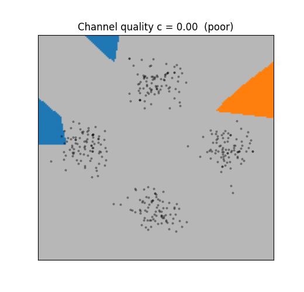
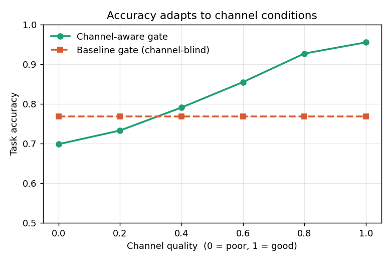
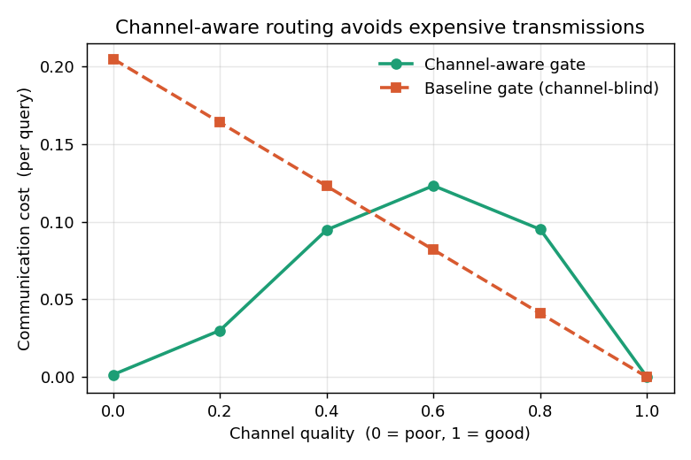
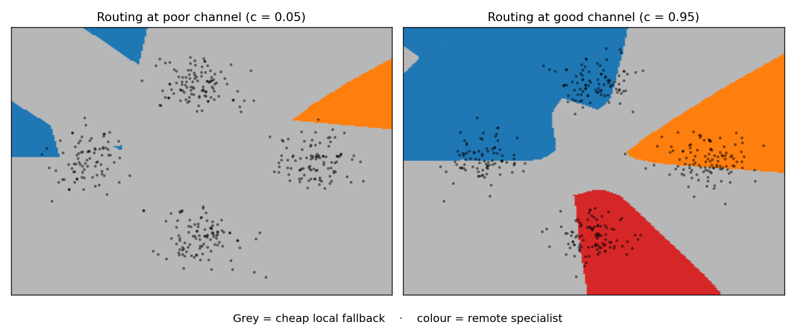
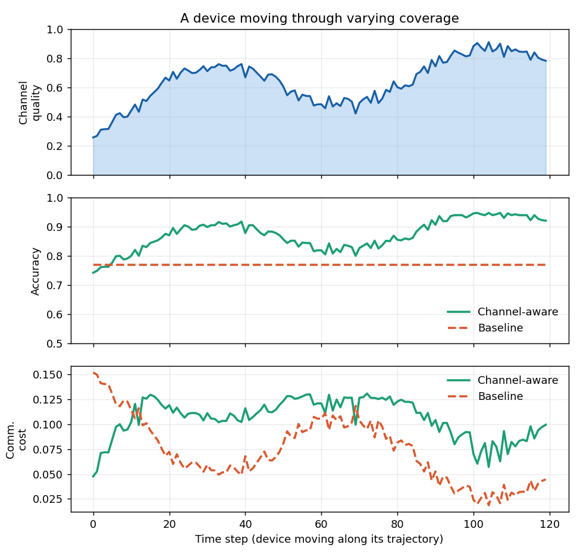

# CAMoE — Channel-Aware Mixture-of-Experts

[](https://github.com/kabNath/camoe/actions/workflows/ci.yml)
[](https://opensource.org/licenses/MIT)
[](https://www.python.org/downloads/)

> A small, runnable proof-of-concept: a Mixture-of-Experts router that looks at **wireless channel quality** before deciding whether to pay for a remote specialist expert or fall back to a cheap local one.

Trains in a few seconds on CPU. One command reproduces every number and figure below.

```bash
pip install -e .
python demo.py
```



*As the channel quality sweeps from poor to good, the gate shifts from the grey local fallback to the coloured remote specialists — a policy it learned on its own.*

## The idea in one sentence

In a standard Mixture-of-Experts model, the router (gate) picks experts based only on the input. But if some experts live on a **remote server reached over a wireless link**, routing to them costs bandwidth and energy — and that cost explodes when the radio channel is poor. CAMoE feeds the **channel quality** into the gate, so it learns to use remote specialists when the channel is good and a cheap local fallback when the channel is bad.

## Result

A channel-aware gate is compared against an identical baseline whose gate cannot see the channel. Both are trained on the same synthetic task with the same cost penalty. Averaged over all channel conditions:

| Metric | Baseline (channel-blind) | Channel-aware | Change |
|---|---|---|---|
| Task accuracy | 0.769 | **0.826** | **+5.8 points** |
| Communication cost | 0.102 | **0.057** | **−44%** |

The channel-aware gate wins on **both** axes at once: higher accuracy *and* lower communication cost. (Numbers are deterministic with the default seed; reproduce with `python demo.py`.)

### Accuracy adapts to the channel



The channel-aware gate climbs from ~70% accuracy on a poor channel (where it falls back to the cheap local head) to ~95% on a good channel (where it pays for specialists). The baseline is flat — it committed to a single strategy because it cannot see the channel.

### It avoids expensive transmissions



The win is clearest at a **poor** channel (left side), where transmission is most expensive: the channel-aware gate spends almost nothing there, while the baseline keeps paying. The channel-aware gate spends its communication budget where it is cheap (good channel), not where it is expensive.

### What the gate actually learned



Each pixel is coloured by the route the gate picks for an input at that location. On a **poor** channel (left) almost everything routes to the grey local fallback. On a **good** channel (right) the four data clusters route to their coloured remote specialists. The gate learned the channel-conditional policy on its own.

## One more view: mobility

A device moving through varying coverage, as if a phone or a UAV passes in and out of good radio conditions. Run with `python extras.py`.



The channel-aware gate's accuracy tracks the channel — climbing when coverage is good (it pays for specialists), easing off when coverage drops. The baseline is flat. Quantitatively, the correlation between channel quality and how often the channel-aware gate routes to a remote specialist is **0.99**; for the baseline it is undefined, because its routing never changes with the channel.

## How it works

- **Task** — a 2D classification problem with four Gaussian clusters, each split into two interleaved sub-classes by an XOR pattern (so the task is not linearly separable). 2D keeps it easy to visualize.
- **Experts** — four nonlinear specialist MLPs (one effectively per cluster) plus one small linear-ish **local fallback**. Specialists are accurate but "remote"; the fallback is weaker but "local" and free.
- **Gate** — an MLP router. The channel-aware variant takes the input *and* a scalar channel-quality value `c ∈ [0, 1]`; the baseline takes only the input.
- **Cost model** — reaching a remote specialist costs `(1 − c) · TX_COST`: expensive on a poor channel, free on a perfect one. The local fallback costs nothing.
- **Objective** — `cross_entropy + β · communication_cost + load_balancing`. A short warm-up at `β = 0` lets the experts and gate learn the task before the cost pressure is ramped in (otherwise the gate collapses to always-local and the specialists never train).
- **Routing** — straight-through top-1 (hard forward pass, soft gradient) so each expert specialises cleanly.

See [`camoe/model.py`](camoe/model.py) for the model and [`camoe/train.py`](camoe/train.py) for the objective.

## Project layout

```
camoe/
├── data.py       synthetic multi-regime task (XOR-in-cluster)
├── experts.py    Expert, LocalFallback, Gate modules
├── model.py      ChannelAwareMoE — routing + cost model
├── train.py      training loop (beta warm-up) + evaluation
├── viz.py        the three core result figures
├── analysis.py   beta sweep + accuracy/cost frontier (optional, not featured)
├── mobility.py   time-varying-channel scenario
└── animate.py    routing-animation GIF
demo.py           core demo: train, evaluate, plot, summarise
extras.py         supplementary figures: mobility + animation GIF
notebooks/
└── explore.ipynb interactive walkthrough (pre-run, with outputs)
tests/            pytest suite (6 tests)
```

## Reproduce / test

```bash
pip install -e ".[dev]"
python demo.py        # core table + 3 figures (~15 s)
python extras.py      # mobility scenario + animation GIF (~30 s)
pytest -v             # 6 tests, ~12 s on CPU
```

Prefer to poke at it interactively? Open [`notebooks/explore.ipynb`](notebooks/explore.ipynb) — it ships pre-run with outputs, and includes a `show_routing(c)` helper to inspect the gate at any channel value.

The test suite checks tensor shapes, the cost model (zero cost on a perfect channel, free local fallback), and the core claim: the channel-aware gate adapts its accuracy to the channel while the channel-blind baseline, by construction, does not.

## Scope and honesty

This is a **proof-of-concept on a synthetic task**, not a production system or a trained LLM. It exists to demonstrate one idea cleanly: that exposing wireless channel state to a MoE router improves the accuracy/communication trade-off. It is the toy version of a larger research direction on wireless-aware federated MoE for LLM agents.

## Author

**Wendenda Nathanael Kaboré** — PhD candidate, National Taipei University of Technology (NTUT), Taipei. Research in AI-native wireless systems, multi-agent deep reinforcement learning, and federated learning for 6G.
ORCID: [0009-0006-8255-8711](https://orcid.org/0009-0006-8255-8711)

## License

MIT — see [LICENSE](LICENSE).
